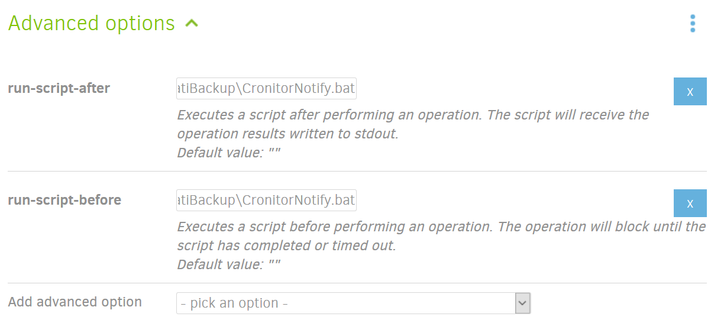

Duplicati / Cronitor Integration
================================

An unmonitored backup is no backup at all.

[Duplicati][1] can run scripts both before and after a backup job. Use the script here to automatically monitor your Duplicati backup jobs with [Cronitor][2].

It would be pretty trivial to modify this so it uses some other monitoring solution than just Cronitor as well.

Getting Started
---------------

1. Clone this repo to the computer that's running Duplicati.
2. Create a Cronitor monitor, and note the monitor code (should look something like "JUwLiX").
3. Follow the simple instructions in the [CronitorNotify template script][3], adding the monitor code to the file and renaming it to `CronitorNotify.bat`.
4. Create a Duplicati backup job. On the last backup configuration step, under _Advanced options_, add the `run-script-before` and `run-script-after` options.
5. Put the full file path to the `CronitorNotify.bat` script in those options.
    
6. Run your Duplicati backup, and notice that Cronitor is notified both when the backup starts running and when it finishes.

Tips
----

This script will notify Cronitor when the backup encounters an error, however you should also set up Cronitor to notify you if the backup doesn't run to completion within X number of days. This guarantees that _even if the backup stops running altogether_, you'll still get a notification that something is going wrong.

[1]: https://www.duplicati.com/
[2]: https://cronitor.io/
[3]: CronitorNotify.bat.template
